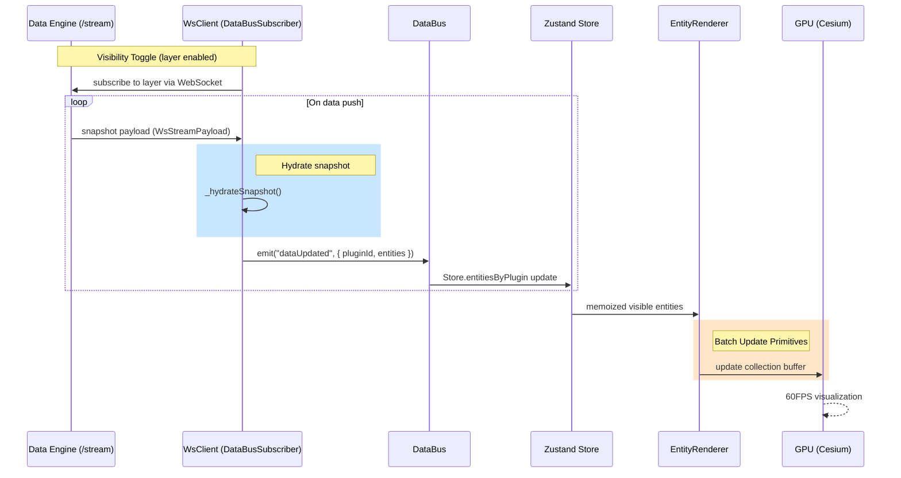

# System Architecture

WorldWideView is a high-performance, event-driven geospatial intelligence engine. It is designed to ingest live, fast-moving signals—such as aviation ADS-B, maritime AIS, or satellite feeds—and transform them into cinematic, real-time visual layers on a 3D globe.

## Module Breakdown

1. **`src/core/plugins`**: The registration and lifecycle management layer. Defines how plugins are booted and destroyed. Three plugin architectures are supported:
   - **Static** — GeoJSON file in `public/data/`, loaded by `StaticDataPlugin`
   - **Active Proxied** — Next.js API routes in `src/app/api/` acting as a CORS proxy
   - **Microservice** — Standalone Fastify container with SQLite (e.g., `iranwarlive-backend`)
2. **`src/core/data`**: The "Heartbeat" of the system.
   - **DataBus**: Decentralized event pipeline for all system actions.
   - **PollingManager**: Intelligent scheduler for external API calls with backoff logic.
   - **CacheLayer**: 2-stage persistent caching (In-Memory + IndexedDB).
3. **`src/core/globe`**: The Rendering Engine.
   - **Cesium Integration**: Low-level control over the Cesium Viewer.
   - **EntityRenderer**: High-performance "Primitive" renderer.
   - **AnimationLoop**: Horizon culling, hover/selection at 60FPS.
   - **StackManager**: Groups co-located entities and handles spiderification.
4. **`src/plugins`**: Domain-specific logic (Aviation, Maritime, etc.).

## Performance: Primitives vs. Entities

One of our core design decisions is using **Cesium Primitives** instead of the standard high-level **Entity API** for high-count datasets.

| Feature | Entity API | Primitive API (WWV) |
|---|---|---|
| **Abstraction** | High (Easy to use) | Low (Direct GPU access) |
| **Overhead** | Significant per-entity JS objects | Minimal (Batched rendering) |
| **Max Capacity** | ~1,000 entities | **100,000+ points/billboards** |
| **WWV Use Case** | Info window content | Live data point visualization |

**Why?** The Entity API in Cesium is great for rich features but triggers significant CPU overhead when managing thousands of moving objects. By using `PointPrimitiveCollection` and `BillboardCollection`, WorldWideView batches these draw calls, ensuring 60FPS even with dense global data.

## Data Pipeline (Example: Aviation)

The following diagram traces the journey of a single data point from the data engine to the user's screen. WorldWideView uses a **WebSocket push model** — the data engine streams updates to the client over a persistent `/stream` connection, eliminating the need for repeated HTTP polling:

## Design Principles

- **Single Responsibility (SRP)**: Plugins only handle data mapping; they don't know about the UI or the Cache.
- **Dependency Inversion**: The `PluginManager` communicates with plugins through the `WorldPlugin` interface, allowing new plugins to be added without modifying core code.
- **Event-Driven Architecture**: The system is reactive. Components subscribe to what they need, reducing prop-drilling and unnecessary re-renders.
- **Defensive Programming**: All external API calls in plugins are wrapped in error boundaries and handled by the `PollingManager`'s backoff logic to prevent system-wide failures.
