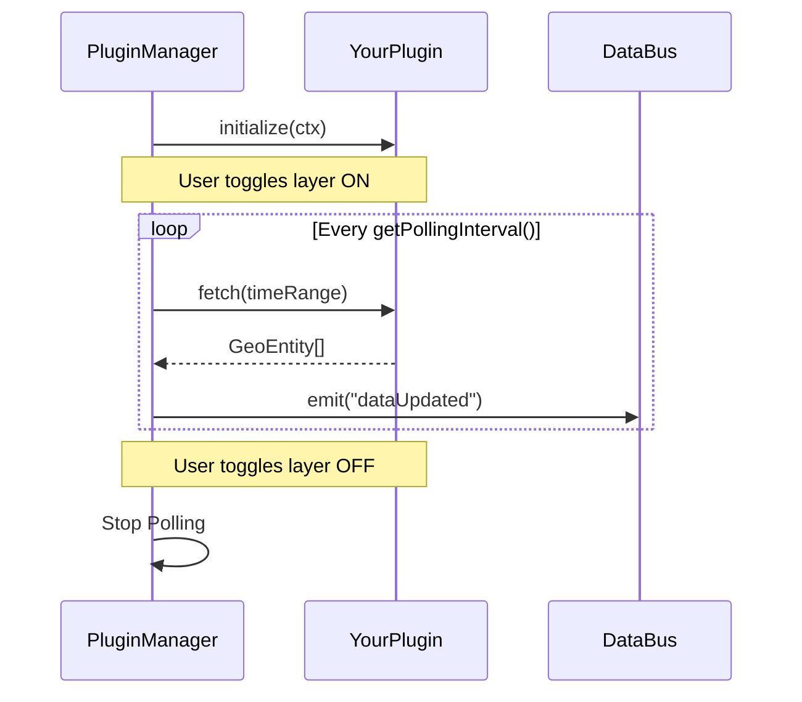

# WorldWideView Plugin Guide

Build custom data layer plugins for the WorldWideView 3D globe platform. This guide covers the full plugin lifecycle, available APIs, and step-by-step instructions for creating your own plugin.

## Architecture Overview

```
┌─────────────────────────────────────────────────┐
│                    UI Layer                      │
│  LayerPanel ─ InfoCard ─ Timeline ─ ConfigPanel  │
└────────────────────┬────────────────────────────┘
                     │ Zustand Store
┌────────────────────┴────────────────────────────┐
│              Plugin Manager                      │
│  register → initialize → enable/disable → poll   │
│          ┌────────┴────────┐                     │
│     PluginRegistry    PollingManager             │
│          │                 │                     │
│     DataBus (events)  CacheLayer (2-tier)        │
└────────────────────┬────────────────────────────┘
                     │
┌────────────────────┴────────────────────────────┐
│           Your Plugin (WorldPlugin)              │
│  fetch() → GeoEntity[] → renderEntity() → Globe  │
└─────────────────────────────────────────────────┘
```

### Plugin Lifecycle

1. **Instantiation**: Your class is instantiated and passed to `pluginRegistry.register()`.
2. **Registration**: The `PluginManager` discovers the plugin in the registry during the boot sequence.
3. **Initialization**: `initialize(ctx)` is called. This is where you should set up your domain-specific API clients or static data.
4. **Enabled State**: When a user toggles the layer in the UI, the `PluginManager` starts the polling cycle.
5. **Fetch/Render Cycle**: `fetch()` is called periodically; `renderEntity()` is called for result.
6. **Destruction**: `destroy()` is called if the plugin is unregistered or the application is unmounted.

### Data Flow



---

## Quick Start: Minimal Plugin

```typescript
// src/plugins/earthquakes/index.ts
import { Activity } from "lucide-react";
import type {
    WorldPlugin, GeoEntity, TimeRange, PluginContext,
    LayerConfig, CesiumEntityOptions,
} from "@/core/plugins/PluginTypes";

export class EarthquakePlugin implements WorldPlugin {
    id = "earthquake";
    name = "Earthquakes";
    description = "Recent seismic activity from USGS";
    icon = Activity;
    category = "natural-disaster" as const;
    version = "1.0.0";

    private context: PluginContext | null = null;

    async initialize(ctx: PluginContext): Promise<void> {
        this.context = ctx;
    }

    destroy(): void {
        this.context = null;
    }

    async fetch(_timeRange: TimeRange): Promise<GeoEntity[]> {
        const res = await fetch("/api/earthquake");
        if (!res.ok) return [];
        const data = await res.json();
        return data.features.map((f: any): GeoEntity => ({
            id: `earthquake-${f.id}`,
            pluginId: "earthquake",
            latitude: f.geometry.coordinates[1],
            longitude: f.geometry.coordinates[0],
            altitude: 0,
            timestamp: new Date(f.properties.time),
            label: `M${f.properties.mag}`,
            properties: {
                magnitude: f.properties.mag,
                depth: f.geometry.coordinates[2],
                place: f.properties.place,
            },
        }));
    }

    getPollingInterval(): number {
        return 120000; // 2 minutes
    }

    getLayerConfig(): LayerConfig {
        return {
            color: "#ef4444",
            clusterEnabled: true,
            clusterDistance: 40,
        };
    }

    renderEntity(entity: GeoEntity): CesiumEntityOptions {
        const mag = (entity.properties.magnitude as number) || 0;
        return {
            type: "point",
            color: mag >= 5 ? "#dc2626" : mag >= 3 ? "#f97316" : "#fbbf24",
            size: Math.max(4, mag * 2),
            outlineColor: "#000000",
            outlineWidth: 1,
        };
    }
}
```

### Register Your Plugin

Built-in plugins are registered in `src/components/layout/AppShell.tsx`. Add your plugin instantiation there alongside the existing ones:

```typescript
import { pluginRegistry } from "@/core/plugins/PluginRegistry";
import { EarthquakePlugin } from "@/plugins/earthquakes";

pluginRegistry.register(new EarthquakePlugin());
```

That's it. The plugin will appear in the Layer Panel and can be toggled on/off.

---

## WorldPlugin Interface Reference

### Required Properties

| Property | Type | Description |
|---|---|---|
| `id` | `string` | Unique identifier (e.g. `"aviation"`, `"earthquake"`) |
| `name` | `string` | Display name shown in the Layer Panel |
| `description` | `string` | Short description shown below the name |
| `icon` | `string \| ComponentType` | Lucide icon component or emoji string |
| `category` | `PluginCategory` | Grouping in the Layer Panel |
| `version` | `string` | Semver version string |

**Available categories:** `aviation`, `maritime`, `conflict`, `natural-disaster`, `infrastructure`, `cyber`, `economic`, `custom`

### Required Methods

#### `initialize(ctx: PluginContext): Promise<void>`

Called once when the plugin is registered. Store the context for later use.

```typescript
interface PluginContext {
    apiBaseUrl: string;          // Base URL for API calls
    timeRange: TimeRange;        // Current time window
    onDataUpdate: (entities: GeoEntity[]) => void;  // Push data updates
    onError: (error: Error) => void;                // Report errors
}
```

#### `destroy(): void`

Cleanup when the plugin is unregistered. Release any resources.

#### `fetch(timeRange: TimeRange): Promise<GeoEntity[]>`

Called by the polling system at your declared interval. Return an array of `GeoEntity` objects representing your data points.

#### `getPollingInterval(): number`

Return the polling interval in milliseconds. This determines how often `fetch()` is called.

#### `getLayerConfig(): LayerConfig`

Return the default layer configuration. These values are used to initialize the UI and the renderer:

```typescript
interface LayerConfig {
    color: string;              // Default CSS color for primary visualization
    iconUrl?: string;           // Default icon for billboards (if applicable)
    clusterEnabled: boolean;    // Enable spatial clustering at high zoom levels
    clusterDistance: number;     // Cluster radius in pixels (suggested: 40)
    minZoomLevel?: number;      // Hide entities when camera is too far (meters)
    maxEntities?: number;       // Limit for performance safety
    showLabelsByDefault?: boolean; // If true, labels show without hover
}
```

#### `renderEntity(entity: GeoEntity): CesiumEntityOptions`

Called for each entity to determine how it appears on the globe:

```typescript
interface CesiumEntityOptions {
    type: "billboard" | "point" | "polyline" | "polygon" | "label";
    color?: string;             // CSS color string
    size?: number;              // Pixel size (for points)
    iconUrl?: string;           // Image URL (for billboards)
    rotation?: number;          // Degrees, applied to billboards
    outlineColor?: string;      // CSS color for point outlines
    outlineWidth?: number;      // Outline width in pixels
    labelText?: string;         // Text label above the entity
    labelFont?: string;         // CSS font string for labels
}
```

### Optional Methods

#### `getSelectionBehavior(entity: GeoEntity): SelectionBehavior | null`

Return trail rendering and camera behavior when an entity is selected. Return `null` for default behavior.

```typescript
interface SelectionBehavior {
    showTrail?: boolean;              // Render a trail polyline
    trailDurationSec?: number;        // Trail length in seconds (default: 60)
    trailStepSec?: number;            // Trail point spacing (default: 5)
    trailColor?: string;              // CSS color (default: '#00fff7')
    flyToOffsetMultiplier?: number;   // Camera offset multiplier (default: 3)
    flyToBaseDistance?: number;        // Base camera distance in meters (default: 30000)
}
```

**Example:** Show trails only for airborne entities:
```typescript
getSelectionBehavior(entity: GeoEntity): SelectionBehavior | null {
    if (entity.properties.on_ground) return null;
    return { showTrail: true, trailColor: "#00fff7" };
}
```

#### `getServerConfig(): ServerPluginConfig`

Declare your plugin's server-side data layer requirements:

```typescript
interface ServerPluginConfig {
    apiBasePath: string;         // e.g. "/api/aviation"
    pollingIntervalMs: number;   // Server-side polling interval
    requiresAuth?: boolean;      // OAuth/API key needed
    historyEnabled?: boolean;    // Supports timeline playback
    availabilityEnabled?: boolean; // Reports time ranges
}
```

> **Note:** The current server infrastructure (API routes, background polling) is set up per-plugin in `src/app/api/<pluginId>/` and `src/lib/`. See [Server-Side Data Layer](#server-side-data-layer) for the pattern.

#### `getSidebarComponent(): ComponentType`

Return a React component to render in the sidebar when this plugin's layer is active.

#### `getDetailComponent(): ComponentType<{ entity: GeoEntity }>`

Return a React component to render in the detail panel when an entity from this plugin is selected.

---

## GeoEntity

The universal data model for all plugin entities:

```typescript
interface GeoEntity {
    id: string;                              // Unique ID (prefix with pluginId)
    pluginId: string;                        // Must match your plugin's `id`
    latitude: number;                        // WGS84 latitude
    longitude: number;                       // WGS84 longitude
    altitude?: number;                       // Meters above sea level
    heading?: number;                        // Degrees (0 = North, 90 = East)
    speed?: number;                          // Meters per second
    timestamp: Date;                         // When this data was captured
    label?: string;                          // Short display label
    properties: Record<string, unknown>;     // Plugin-specific data
}
```

**Conventions:**
- **`id`** — Prefix with your plugin ID to avoid collisions: `"earthquake-us7000abc"`
- **`heading` + `speed`** — If both are set, the renderer will extrapolate movement between polls (smooth animation)
- **`properties`** — Use for domain-specific data (e.g. magnitude, vessel type, altitude). These are accessible in info cards and detail panels

---

## Core Services

### DataBus — Event Communication

Subscribe to cross-plugin events:

```typescript
import { dataBus } from "@/core/data/DataBus";

// Available events
dataBus.on("dataUpdated", ({ pluginId, entities }) => { ... });
dataBus.on("entitySelected", ({ entity }) => { ... });
dataBus.on("layerToggled", ({ pluginId, enabled }) => { ... });
dataBus.on("timeRangeChanged", ({ timeRange }) => { ... });
dataBus.on("cameraPreset", ({ presetId }) => { ... });
```

### CacheLayer — Two-Tier Caching

The PluginManager automatically caches your `fetch()` results in:
1. **Memory** — instant recall within the same session
2. **IndexedDB** — survives page refreshes

You don't need to interact with the cache directly — it's managed by the PluginManager.

### PollingManager — Automatic Polling

Your `getPollingInterval()` return value is used to set up automatic polling. Features:
- **Exponential backoff** on errors (up to 60s max)
- **Pause/resume** support
- **Dynamic interval updates** — users can adjust intervals in the Config Panel

---

## Server-Side Data Layer

For plugins that need server-side processing (API proxying, database persistence, authentication), follow this pattern:

### 1. Create an API Route

```
src/app/api/<your-plugin>/route.ts
```

```typescript
import { NextResponse } from "next/server";

export async function GET() {
    // Fetch from your data source
    const res = await fetch("https://api.example.com/data", {
        headers: { "Authorization": `Bearer ${process.env.YOUR_API_KEY}` },
        cache: "no-store",
    });

    if (!res.ok) {
        return NextResponse.json({ error: res.statusText }, { status: res.status });
    }

    const data = await res.json();
    return NextResponse.json(data);
}
```

### 2. Optional: Background Polling

For APIs with rate limits, create a server-side polling module:

```
src/lib/<your-plugin>-polling.ts
```

Register it in `src/instrumentation.ts`:

```typescript
export async function register() {
    if (process.env.NEXT_RUNTIME === "nodejs") {
        const { startYourPluginPolling } = await import("./lib/your-plugin-polling");
        startYourPluginPolling();
    }
}
```

### 3. Optional: History Endpoint

For timeline/playback support, add a history route:

```
src/app/api/<your-plugin>/history/route.ts
```

Accept a `?time=<ms>` parameter and return the closest historical records.

### 4. Declare in Plugin

Use `getServerConfig()` to document your server-side setup:

```typescript
getServerConfig(): ServerPluginConfig {
    return {
        apiBasePath: "/api/earthquake",
        pollingIntervalMs: 120000,
        historyEnabled: false,
    };
}
```

---

## Rendering Details

### Billboard vs Point

| Feature | `billboard` | `point` |
|---|---|---|
| Custom image | Yes via `iconUrl` | No |
| Rotation | Yes via `rotation` | No |
| Performance | Good (GPU batched) | Best (single draw call) |
| Outline | No | Yes via `outlineColor/Width` |

**Use billboards** for entities with custom icons and rotation (aircraft, vehicles).
**Use points** for simpler markers (fires, earthquakes, vessels).

### Labels

Labels are automatically hidden at long distances and shown within 500km or on hover/selection. Configure via `labelText` and `labelFont` in your `renderEntity()` return.

### Position Extrapolation

If your `GeoEntity` has both `heading` and `speed` set, the globe renderer will automatically extrapolate smooth movement between polling intervals (up to 5 minutes). This creates fluid animation without increasing your API call frequency.

---

## Existing Plugin Examples

| Plugin | Category | Data Source | Rendering | Selection |
|---|---|---|---|---|
| [Aviation](../src/plugins/aviation/index.ts) | `aviation` | OpenSky Network (live + Supabase fallback) | Billboards with altitude-based coloring | Trail polyline for airborne entities |
| [Maritime](../src/plugins/maritime/index.ts) | `maritime` | AIS feeds (with demo fallback) | Points with vessel-type coloring | Default |
| [Wildfire](../src/plugins/wildfire/index.ts) | `natural-disaster` | NASA FIRMS (VIIRS) | Points with FRP-based sizing/coloring | Default |

---

## Checklist: Publishing a Plugin

- [ ] Implements all required `WorldPlugin` methods
- [ ] `id` is unique and lowercase (no spaces)
- [ ] All `GeoEntity.id` values are prefixed with your plugin ID
- [ ] `GeoEntity.pluginId` matches your plugin's `id`
- [ ] `renderEntity()` returns valid `CesiumEntityOptions`
- [ ] API route created (if needed) at `src/app/api/<id>/`
- [ ] Plugin registered in the app initialization code
- [ ] Tested: toggle on/off in Layer Panel
- [ ] Tested: entity hover and click selection
- [ ] Tested: info card displays your `properties` correctly
